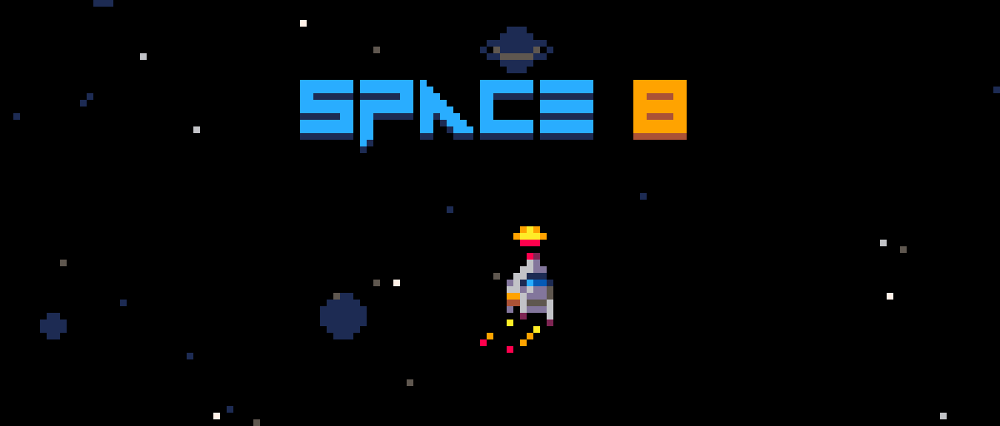

# Space 8 (PICO-8)

    

**Space 8** is a retro-inspired arcade game for the PICO-8 fantasy console. Blast asteroids, dodge comets, and survive as long as you can!

## Features
- Classic arcade-style gameplay
- Power-ups, scores, and upgrades
- Custom music and sound effects
- Optimized for web export and PICO-8

## How to Play
- Arrow keys: Move your ship
- Z/C/N: Shoot
- X/V/M: Use your shield
- Avoid obstacles and collect power-ups to survive longer

## Screenshots

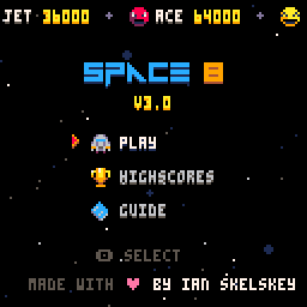  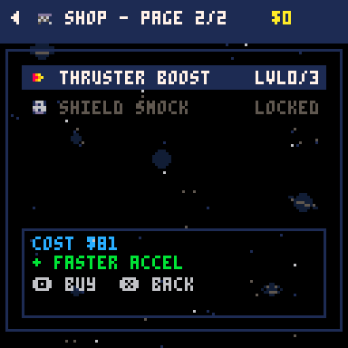 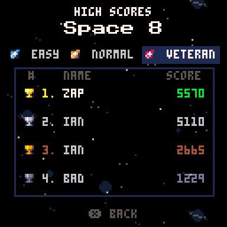 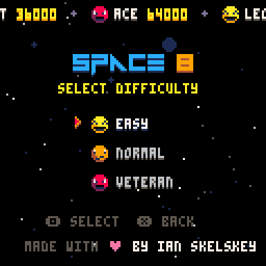  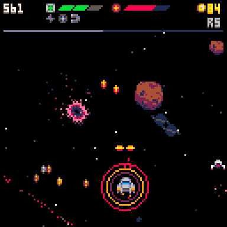   

## Obstacles

| Sprite                                                                                                                      | Name       | Description                                                                                                 |
| --------------------------------------------------------------------------------------------------------------------------- | ---------- | ----------------------------------------------------------------------------------------------------------- |
|                                                                          | Asteroid   | Large space rock that moves slowly. Can be destroyed with multiple hits. Breaks into chunks when destroyed. Chance to drop money. |
|     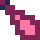 | Comet      | Fast-moving space debris that cannot be destroyed. Must be avoided to prevent damage. Chance to drop powerups                       |
|                                                                                                | Black Hole | A dangerous space anomaly that pulls the player in. Avoid getting too close or you'll be sucked in!         |

## Upgrades

Purchasables available at the Station shop.

| Icon | Name | Description |
| ---- | ---- | ----------- |
|  | Fire Rate | +20% fire rate per level (max 3). |
| 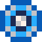 | Shield | Unlocks shield, then strengthens it per level (max 3). |
|  | Phaser Spread | Adds side beams per level (max 2). |
|  | Hull | +1 hull segment per level (max 2). Grants +1 HP when purchased. |
| 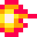 | Thrusters | Faster acceleration per level (max 3). |
| 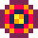 | Shield Shock | Emits a damaging pulse on hit (max 2). Requires Shield. |
|  | Repair Hull | Restores 1 hull, up to current max. Cost scales with round. |

## Power-ups

Dropped by comets during missions. Temporary or immediate effects.

| Icon | Name | Description |
| ---- | ---- | ----------- |
|  | Hull | +1 HP if you have room; dropped from green comets. |
|  | Shield Refill | Fully recharges shield; gives free shield time; dropped from blue comets. |
|  | Rapid | Temporary burst of faster fire; dropped from yellow comets. |
|  | Magnet | Attracts nearby loot and pickups; dropped by pink comets. |

## Development
- All source code is in Lua, designed for PICO-8
- Music and sound created with PICO-8 tools
- Web export available in the `build/` folder

## Running the Game
1. Open PICO-8
2. This project now uses a multi-cart setup:
    - `ui.p8` : menus, station, shop, game over
    - `space_8.p8` : gameplay (action loop + entities)
3. Launch the UI cart first: `load ui.p8` then `run`
4. Selecting a difficulty / launch mission loads `space_8.p8` automatically (state passed via `cartdata`)
5. When a mission ends or you die, the gameplay cart saves back to `cartdata` and loads `ui.p8` to show station or game over
6. To export for web you must export both carts (PICO-8 will bundle dependencies if you chain from the UI cart). Example:
    - `export space_8.html ui.p8` (PICO-8 will include the gameplay cart it loads)

### Persisted Values Between Carts
The following values are serialized with `dset/dget` (indices documented in `src/persist.lua`): difficulty, round, visible round, money, last payout + bonus, score totals (ts,tsh), upgrade levels (fire, shield, spread, hull, thruster), shield unlocked, current hull, payout-ready flag, and a start flag instructing gameplay cart to begin a mission immediately.

## Hardware

I really wanted to try my game on actual hardware, so I picked up an Anbernic RG40XXH handheld console that supports PICO-8. Super satisfying to see it running on real hardware!

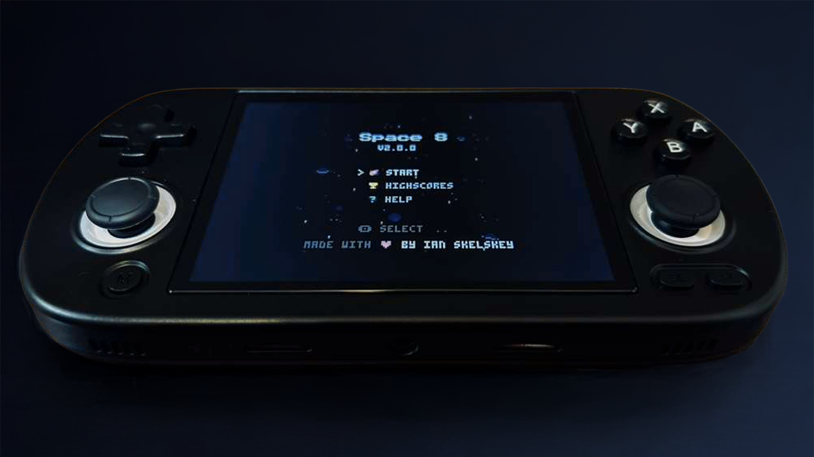