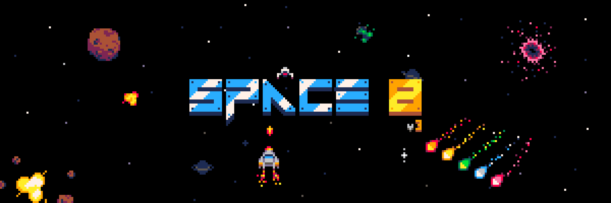

# Space 8 (PICO-8)

    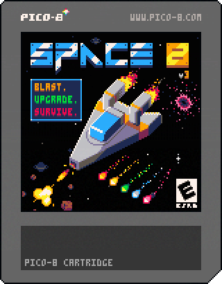

    
    

**Space 8** is a compact arcade survival game for the PICO-8 fantasy console. Pilot a small ship through escalating debris fields, collect credits during each mission, and dock at the Station between rounds to buy upgrades for the next launch.

Click one of the buttons above to play online, or search for "Space 8" in Splore.

Space 8 originally began as a way to prepare for the [PVGD PICOJam 2025](https://pvgd.org/picojam2025/), a Western Massachusetts PICO-8 jam organized by the Pioneer Valley Game Developers.

## What to Expect

- Score-chasing arcade missions where the pressure never stops climbing — the ramp keeps going long after your ship is fully upgraded, so every run eventually ends
- Asteroids, color-coded comets, black holes, and alien gunners
- Credits collected mid-flight and spent at the Station shop
- Persistent upgrades for fire rate, shields, spread, hull, thrusters, and shield shock
- Custom PICO-8 pixel art, music, and sound effects

## How to Play

- Arrow keys: move your ship
- Z/C/N: shoot
- X/V/M: use your shield
- Avoid hazards, grab power-ups, collect credits, and survive long enough to reach the Station

## Screenshots

      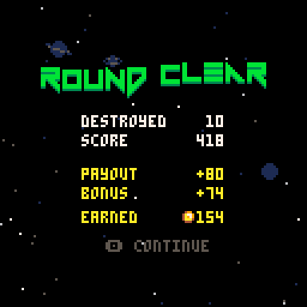   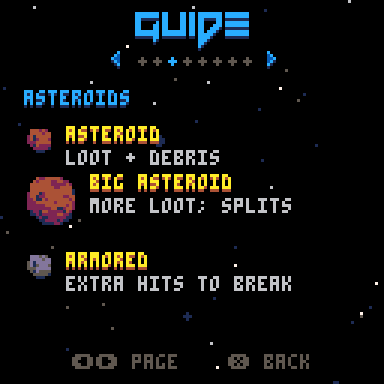

## Obstacles

| Sprite                                                                                                                      | Name       | Description                                                                                                 |
| --------------------------------------------------------------------------------------------------------------------------- | ---------- | ----------------------------------------------------------------------------------------------------------- |
|                                                                          | Asteroid   | Slow-moving space rock. Takes multiple hits and splits into smaller chunks when destroyed. Chance to drop money. |
| 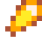     | Comet      | Fast movers that arrive from round 3. Takes two hits to destroy, and each colour drops a different power-up — or just dodge them. |
|                                                                                                | Black Hole | A space anomaly that appears from round 5 and pulls your ship inward. Death on contact — your shield won't save you, so thrust away early. |
| 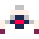                                                                                                     | Popcorn    | A little alien gunner that weaves down from round 2, winds up, and spits a shot tracked toward you. Takes two hits to pop and usually drops money. |

## Upgrades

Purchasables available at the Station shop.

| Icon | Name | Description |
| ---- | ---- | ----------- |
|  | Fire Rate | +20% fire rate per level (max 3). |
|  | Shield | Unlocks shield, then strengthens it per level (max 3). |
|  | Phaser Spread | Adds side beams per level (max 2). |
|  | Hull | +1 hull segment per level (max 2). Grants +1 HP when purchased. |
|  | Thrusters | Higher top speed per level (max 3). |
|  | Shield Shock | Emits a damaging pulse on hit (max 2). Requires Shield. |
|  | Repair Hull | Restores 1 hull, up to current max. Cost scales with round. |

## Power-ups

Dropped by comets during missions. Effects are temporary and reset at the end of each round.

| Icon | Name | Description |
| ---- | ---- | ----------- |
| 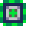 | Hull | +1 HP if you have room; dropped by green comets. |
| 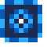 | Charge | Fully recharges your shield and grants a stretch of free shield time; dropped by blue comets. |
| 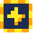 | Rapid | A ~3 second burst of faster fire; dropped by yellow comets. |
| 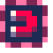 | Magnet | Pulls nearby loot and pickups toward you; dropped by pink comets. |
| 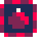 | Bomb | Detonates an expanding shockwave that vaporises every obstacle it sweeps over; dropped (rarely) by red comets. |

## Credits

Coins dropped by destroyed asteroids and enemies. Scoop them up mid-mission to fund upgrades at the Station — they come in three tiers (rarer coins are worth more).

| Coin | Tier | Value |
| ---- | ---- | ----- |
| 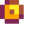 | Bronze | 2 credits (common) |
| 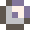 | Silver | 4 credits |
| 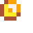 | Gold | 8 credits (rare) |

## Free Assets

Want to make your own shmup? The tilesheet and assets from this game are available for free download on itch.io:

    

    
    

## Tinkering

This repository is public so people can study a finished PICO-8 project, fork it locally, and experiment with how the carts, entities, UI, art, and audio fit together. It is not an open call for outside development, but it is meant to be useful as an educational reference.

See [CONTRIBUTING.md](CONTRIBUTING.md) for local running, export, cart handoff, and tinkering notes.

## License

A formal project license has not been added yet. Until one is chosen, treat Space 8, its name, shipped carts, source, art, music, sound effects, and documentation as shared for play, study, and personal tinkering only. Please do not redistribute Space 8 or lightly modified builds as your own.

## Hardware

I really wanted to try my game on actual hardware, so I picked up an Anbernic RG40XXH handheld console that supports PICO-8. Super satisfying to see it running on real hardware!

