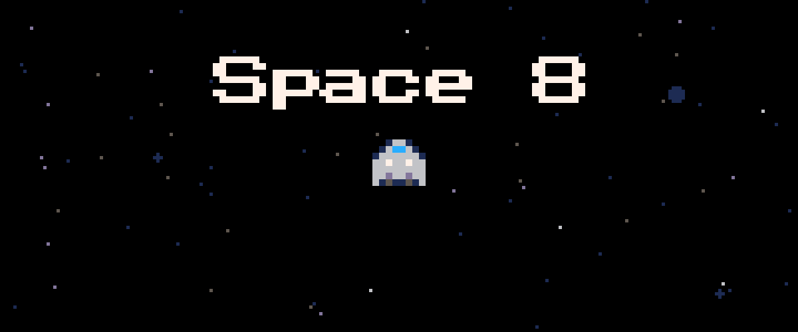

# Space Shooter (PICO-8)

    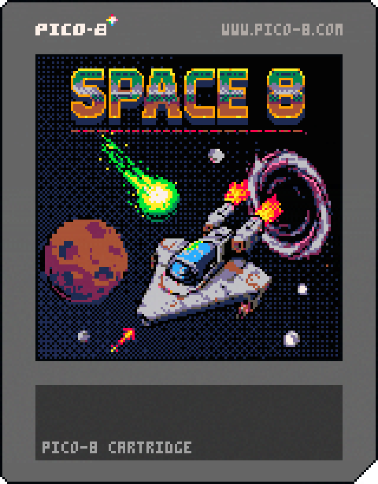

**Space Shooter** is a retro-inspired arcade game for the PICO-8 fantasy console. Blast asteroids, dodge comets, and survive as long as you can!

## Features
- Classic arcade-style gameplay
- Power-ups, scores, and upgrades
- Custom music and sound effects
- Optimized for web export and PICO-8

## How to Play
- Arrow keys: Move your ship
- Z/C/N: Shoot
- X/V/M: Use your shield
- Avoid obstacles and collect power-ups to survive longer

## Screenshots

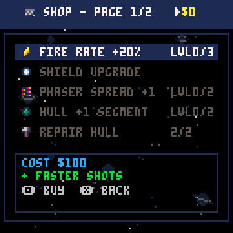
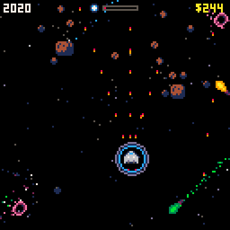
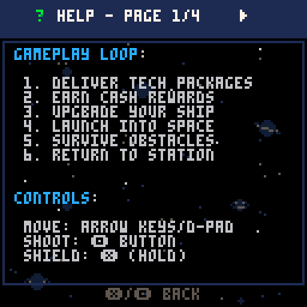
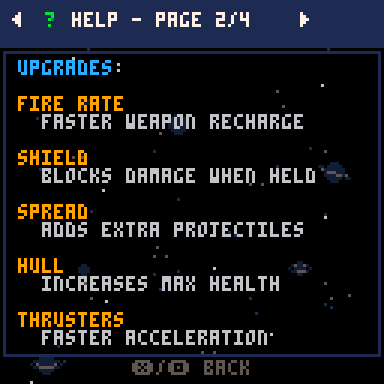
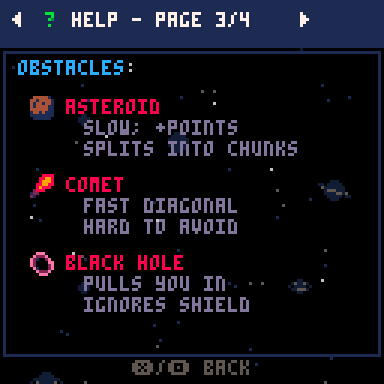
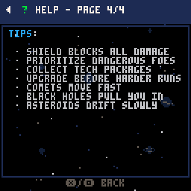
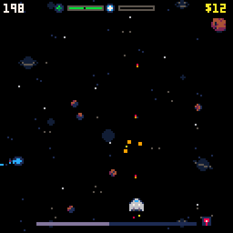
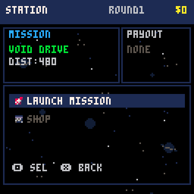
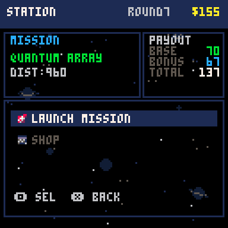
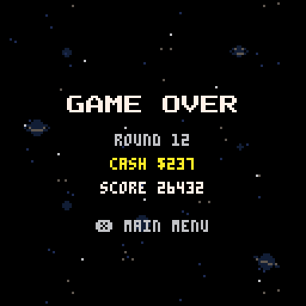

## Obstacles

| Sprite                                                                                                                      | Name       | Description                                                                                                 |
| --------------------------------------------------------------------------------------------------------------------------- | ---------- | ----------------------------------------------------------------------------------------------------------- |
| 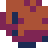 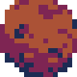                                                                        | Asteroid   | Large space rock that moves slowly. Can be destroyed with multiple hits. Breaks into chunks when destroyed. |
|     | Comet      | Fast-moving space debris that cannot be destroyed. Must be avoided to prevent damage.                       |
| 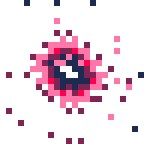                                                                                               | Black Hole | A dangerous space anomaly that pulls the player in. Avoid getting too close or you'll be sucked in!         |

## Upgrades & Power-ups
| Name   | Description                                                                                                                                     |
| ------ | ----------------------------------------------------------------------------------------------------------------------------------------------- |
| Shield | Grants a temporary shield that prevents all damage. If you take too much damage while shielded, the shield will break and need to be recharged. |
| Fire Rate | Increases your ship's firing rate, allowing you to shoot more frequently.                                                  |
| Spread Shot | Allows your ship to fire multiple projectiles in a spread pattern, increasing your chances of hitting targets. |

## Development
- All source code is in Lua, designed for PICO-8
- Music and sound created with PICO-8 tools
- Web export available in the `build/` folder

## Running the Game
1. Open PICO-8
2. This project now uses a multi-cart setup:
    - `ui.p8` : menus, station, shop, game over
    - `space_shooter.p8` : gameplay (action loop + entities)
3. Launch the UI cart first: `load ui.p8` then `run`
4. Selecting a difficulty / launch mission loads `space_shooter.p8` automatically (state passed via `cartdata`)
5. When a mission ends or you die, the gameplay cart saves back to `cartdata` and loads `ui.p8` to show station or game over
6. To export for web you must export both carts (PICO-8 will bundle dependencies if you chain from the UI cart). Example:
    - `export space_8.html ui.p8` (PICO-8 will include the gameplay cart it loads)

### Persisted Values Between Carts
The following values are serialized with `dset/dget` (indices documented in `src/persist.lua`): difficulty, round, visible round, money, last payout + bonus, score totals (ts,tsh), upgrade levels (fire, shield, spread, hull, thruster), shield unlocked, current hull, payout-ready flag, and a start flag instructing gameplay cart to begin a mission immediately.

To reset progress: from the UI cart run `cartdata("sp8") for i=0,32 do dset(i,0) end` then restart.

## Credits
- Game by Ian Skelskey
- Music and SFX by Ian Skelskey

## Future Refinements
- Preserve fanfare depart animation across cart switch (currently simplified)
- Pack multiple small integers into single `dset` slots to reclaim indices
- Add versioning / checksum for `cartdata` to allow safe format changes
- Optional cloud/high score persistence layer using exported web wrapper
- Title screen attract mode (demo playback) as third cart if tokens become tight

## License
MIT License. See LICENSE file if present.
