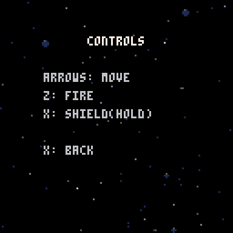
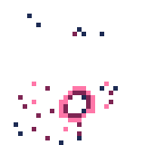

# Space Shooter (PICO-8)

A retro-inspired space shooter game built with PICO-8 fantasy console. Blast asteroids, dodge comets, and survive as long as you can!

## Features
- Classic arcade-style gameplay
- Power-ups, score, and fuel management
- Custom music and sound effects
- Optimized for web export and PICO-8

## How to Play
- Arrow keys: Move your ship
- Z/C/N: Shoot
- X/V/M: Use your shield
- Avoid obstacles and collect power-ups to survive longer

## Screenshots

## Obstacles

| Sprite                                                                                                                      | Name       | Description                                                                                                 |
| --------------------------------------------------------------------------------------------------------------------------- | ---------- | ----------------------------------------------------------------------------------------------------------- |
|                                                                          | Asteroid   | Large space rock that moves slowly. Can be destroyed with multiple hits. Breaks into chunks when destroyed. |
|     | Comet      | Fast-moving space debris that cannot be destroyed. Must be avoided to prevent damage.                       |
|                                                                                                | Black Hole | A dangerous space anomaly that pulls the player in. Avoid getting too close or you'll be sucked in!         |

## Upgrades & Power-ups
| Name   | Description                                                                                                                                     |
| ------ | ----------------------------------------------------------------------------------------------------------------------------------------------- |
| Shield | Grants a temporary shield that prevents all damage. If you take too much damage while shielded, the shield will break and need to be recharged. |
| Fire Rate | Increases your ship's firing rate, allowing you to shoot more frequently.                                                  |
| Spread Shot | Allows your ship to fire multiple projectiles in a spread pattern, increasing your chances of hitting targets. |

## Development
- All source code is in Lua, designed for PICO-8
- Music and sound created with PICO-8 tools
- Web export available in the `build/` folder

## Running the Game
1. Open PICO-8
2. Run `load space_shooter.p8` to load the game
3. Run `run space_shooter.p8` to start playing
4. To export for web: `export -f space_shooter.html`

## Credits
- Game by Ian Skelskey
- Music and SFX by Ian Skelskey

## License
MIT License. See LICENSE file if present.
